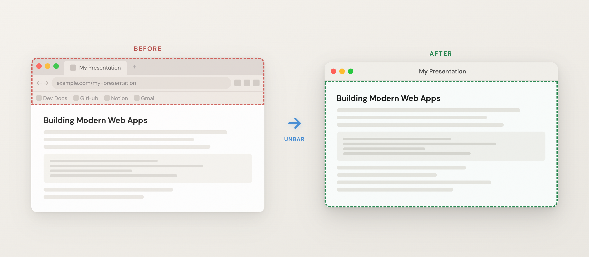
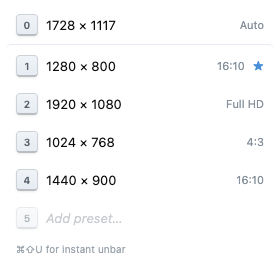
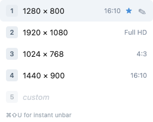
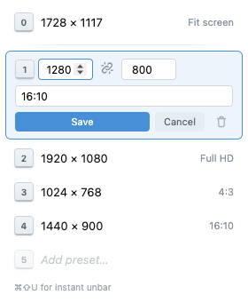

# Unbar

**Pop the current tab into a clean window — no address bar, no tabs.**

<p align="center"></p>

Unbar moves your active Chrome tab into a minimal popup window with no address bar, tab strip, or bookmarks bar. The page doesn't reload, so scroll position, form input, and JavaScript state are all preserved — it's the same tab, just in a cleaner frame.

Built originally to give [Inspire.js](https://inspirejs.org) presentations a distraction-free presenter/projector window, but it works on any page.

| Pick a size | Hover a preset | Edit a preset |
|:-----------:|:-------------:|:-------------:|
|  |  |  |

## Why

Chrome removed the ability to hide the address bar years ago (the old `Compact Navigation` flag is gone), and extensions can't touch native browser chrome. The one exception is `chrome.windows.create({ type: "popup" })`, which opens a window without an address bar. Unbar uses that to relocate your current tab into a clean window on demand.

## Features

- **One-click unbar** — click the toolbar icon, pick a size, done.
- **Fit screen** — key `0` detects the current monitor's available area and opens the window at exactly that size. Always listed first in the popup.
- **Size presets** — keys `1`–`9` select a resolution, arrow keys navigate between rows. Four sensible defaults out of the box (1280×800, 1920×1080, 1024×768, 1440×900).
- **Fully editable** — every preset slot can be edited in place: dimensions and label. Up to nine. Press Escape to cancel. The default (★) is whichever preset you used last (including Fit screen).
- **Aspect-ratio lock** — a chain toggle links width and height so changing one updates the other. Recognizes common ratios (16:9, 16:10, 4:3, 21:9, 3:2, 5:4, 1:1, 32:9).
- **Keyboard shortcut** — `Ctrl+Shift+U` (Windows/Linux) or `Cmd+Shift+U` (macOS) instantly unbars at the last-used size, no popup. Remap at `chrome://extensions/shortcuts`.
- **Persistent** — your presets are saved across sessions via `chrome.storage.local`.

## Privacy

Unbar collects no data. No analytics, no tracking, no network requests. It uses two permissions: `activeTab` (scoped to the tab you explicitly act on) and `storage` (to persist your presets locally). See [PRIVACY.md](PRIVACY.md).

## Install

### From the Chrome Web Store

_(Link to be added once published.)_

### From source (development)

1. Clone this repo:
   ```bash
   git clone https://github.com/DmitrySharabin/unbar.git
   ```
2. Open `chrome://extensions` in Chrome.
3. Enable **Developer mode** (top-right toggle).
4. Click **Load unpacked** and select the `src/` folder.

Requires Chrome 120+.

## Usage

1. Navigate to any page.
2. Click the Unbar icon (or press `Ctrl+Shift+U` / `Cmd+Shift+U`).
3. Choose a size — the active tab moves into a clean window.

To edit a preset, hover a row and click the pencil. To remove one, open it and click the trash icon; remaining presets shift up.

## Build

To produce the `.zip` for Chrome Web Store submission:

```bash
npm run build
```

This zips the contents of `src/` into `unbar.zip` at the repo root.

## Assets

The PNG icons (`src/icons/`) and the store tile (`store/tile-440x280.png`) are generated from the SVG masters in `assets/`. The SVGs are the editable sources; the PNGs are build artifacts. To regenerate after editing a master:

```bash
npm install   # first time only, pulls in sharp
npm run assets
```

Each PNG is rasterized from a high-resolution render and downscaled with Lanczos resampling, which keeps edges crisp at every size. The tile stays at the store-required 440×280.

## License

[MIT](LICENSE)
